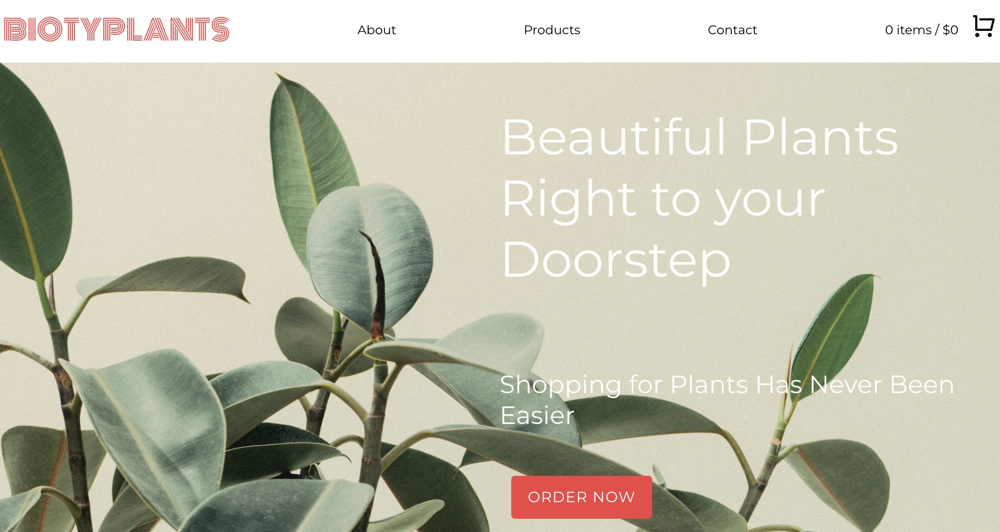
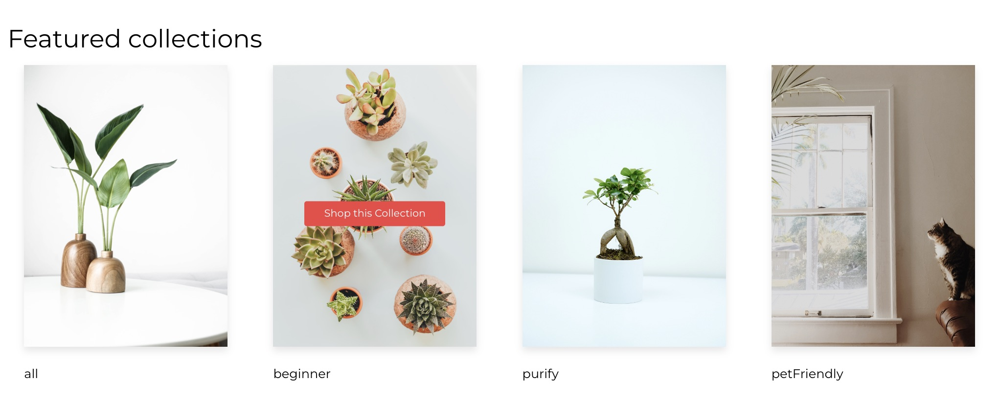
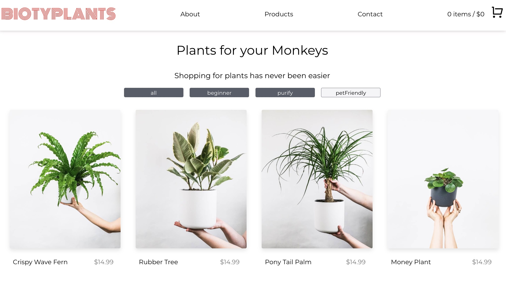
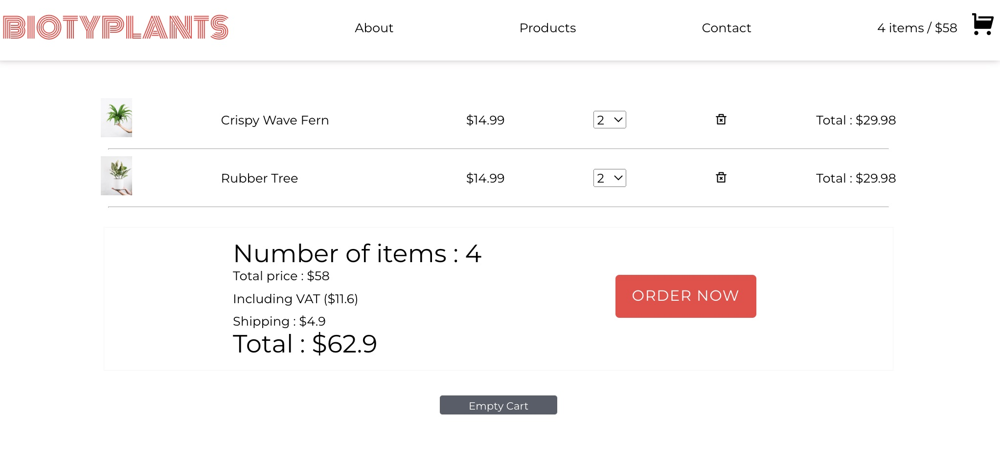
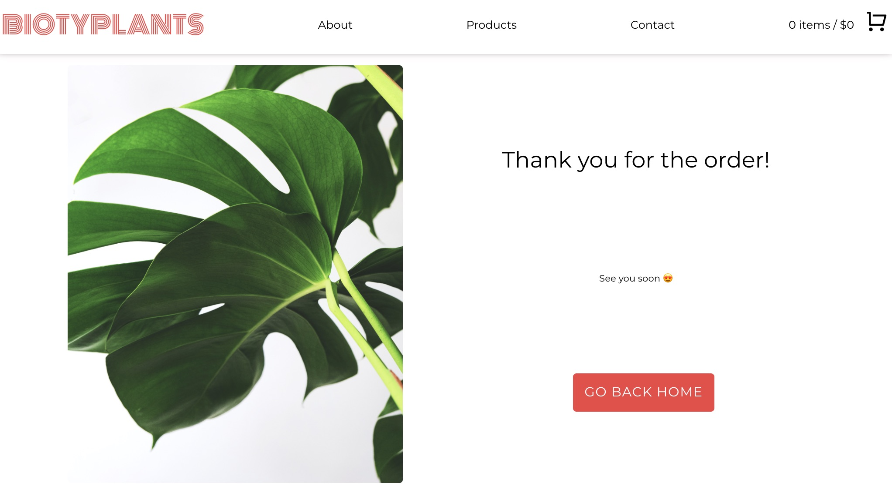

# e-commerce store

### [Live Demo](https://disconico.github.io/shopping_cart/) 👈

Build with React using :

- Hooks / useState, useEffect
- Context
- Ref
- PropTypes
- Custom hooks
- React router
- Custom helper functions
- Reducer (async checkout mocking)

